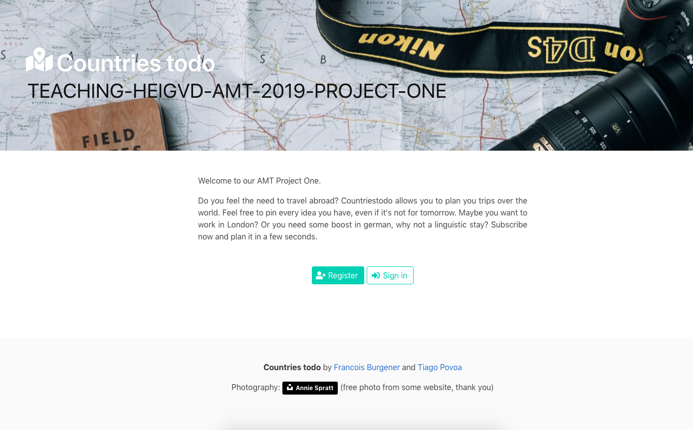
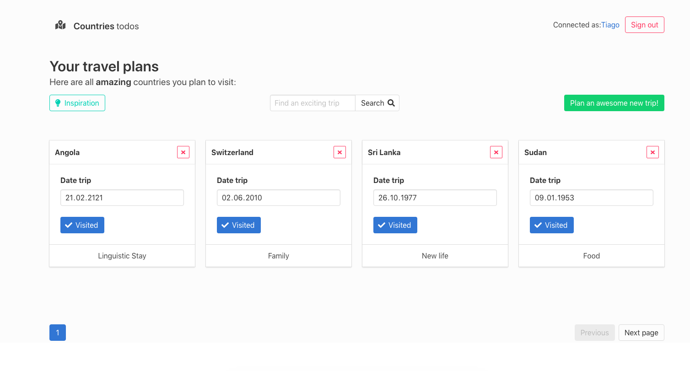
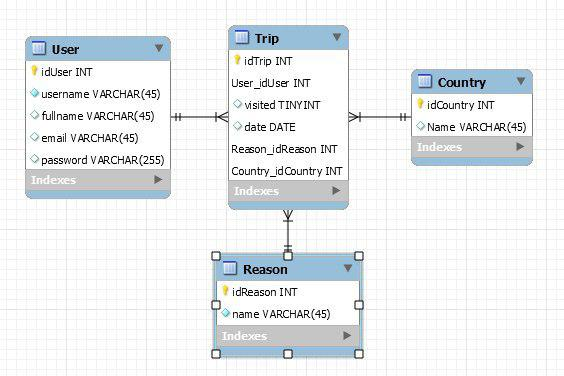
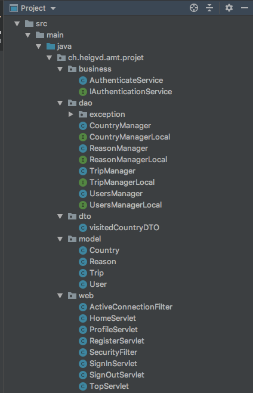
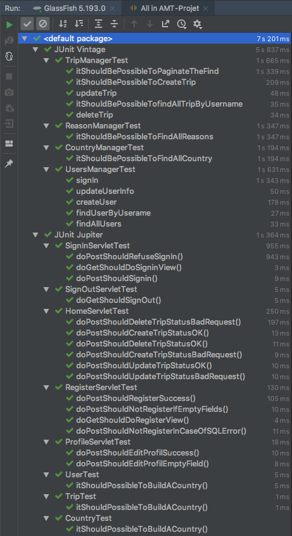

# Teaching-HEIGVD-AMT-2019-Project-One

> François Burgener, Tiago Povoa Q.

## In short

Our project is a web application where you can organize your future trips countries around the world. It runs on Payara. We'll see how to start it in the next chapter.

## Introduction

### Quick Start

In order to run this project, you'll need Docker and Maven.

We recommand to start by runing the following script in the root folder:

`$ ./start.sh`

It will do the following: build the project and start the containers.

Payara, MySql8, phpmyadmin.

And there you go. 

Once it has started, access it at the following address:

`http://{host_docker}:8080/countriestodo/`

### Overview

Let's pass quickly on what you can expect from this app. First you have an index page that invites you to sign up.



Here you can register or directly sign in with one of our preset test users.

`username: toto, password: toto`


And finally, the main page where you can plan your trips. Use the green button to add a new trip. You can delete or update the date and visited status as well. 



The search and the page system is functional. You might as well want to change some account values, you can do it by clicking on the link with your name on it (top of the page, next to sign out).

## Under the hood

### Domain model

Let's deep dive into the domain model. 

## 

We have Users, Countries, Reasons (the motive you traveled for) and finally the trips who link everything together.

### Implementation

You can see below our Java package structure. 



#### Packages

1. Business: security logic (bcrypt)
2. dao: the managing classes responsible of handling the requests to database
3. model: the representation of the data objects. 
4. web: the servlets that handle incoming requests and network aspects (forward, dispatch, ...)
5. dto: visitedCountryDTO is not an actual model, but the result of a more complex query. So we choose not to put it with models. 

## Tests

Our development environment uses a different URL:

`http://{docker_host}:8080/AMT-Projet/`

### Strategies

We used three testing strategies.

1. Unit testing with JUnit 5 and Mockito to mock the classes.
   1. We made dead simple tests for models
   2. Mockito allowed us to mock some parts in the Servlets.
   3. This category of tests is here to give us confidence in what we build and let us quickly change stuff without breaking anything (or at least we can identify it quicker)
2. Integration Testing with Arquillian
   1. Here we tested the managed objects in JavaEE.
   2. We had some difficulties to make it work with Payara since we had to connect in SSL using a certificate. 
   3. We used these tests to see in practice that the managed objects where doing well. It allowed us to see some dead code. We could have experimented a bit more here. 
3. Performance Testing with JMeter
   1. We tested the pagination with load testing.
   2. We'll discuss this matter in the next chapter

### Our tests



If you want to run all our tests, you'll have to connect to Payara with a remote connection. It worked for us by removing the Arquillian plug-in from Intellij. 

```
URL: http://{docker_host}:8080/AMT-Projet/
PORT: 4848
Username: admin
Password: admin
( DEBUG_PORT: 9009 )
```

If you only want to run the unit tests, you don't need those extra steps.

### Performance

To experiment the performance of our app, we compared data from our implemented page size to a ridiculously huge one. Below is our raw data from those tests. It might be a bit overwhelming to read so let's discuss it in the paragraph after the two tables.

#### With

| Page size: 4             |           |         |         |              |
| ------------------------ | --------- | ------- | ------- | ------------ |
| 2100   request           |           |         |         |              |
| Label                    | # Samples | Average | Error % | Avg.   Bytes |
| HTTP Request Sign in     | 100       | 27204   | 0       | 22383        |
| HTTP   Request home page | 2000      | 1490    | 0       | 21760        |
| TOTAL                    | 2100      | 2714    | 0       | 21789,7      |
|                          |           |         |         |              |
| 5100 request             |           |         |         |              |
| Label                    | # Samples | Average | Error % | Avg.   Bytes |
| HTTP Request Sign in     | 100       | 28835   | 0       | 22383        |
| HTTP   Request home page | 5000      | 1268    | 0       | 21760        |
| TOTAL                    | 5100      | 1808    | 0       | 21772,2      |
|                          |           |         |         |              |
| 8100 request             |           |         |         |              |
| Label                    | # Samples | Average | Error % | Avg.   Bytes |
| HTTP Request Sign in     | 100       | 27682   | 0       | 22383        |
| HTTP   Request home page | 8000      | 1168    | 0       | 21760        |
| TOTAL                    | 8100      | 1495    | 0       | 21767,7      |
|                          |           |         |         |              |
| 10100 request            |           |         |         |              |
| Label                    | # Samples | Average | Error % | Avg.   Bytes |
| HTTP Request Sign in     | 100       | 26833   | 0       | 22383        |
| HTTP   Request home page | 10000     | 5555    | 0,0005  | 21750,4      |
| TOTAL                    | 10100     | 5766    | 0,0005  | 21756,7      |

#### Without

| Page size 100k           |           |         |         |              |
| ------------------------ | --------- | ------- | ------- | ------------ |
| 2   request              |           |         |         |              |
| Label                    | # Samples | Average | Error % | Avg.   Bytes |
| HTTP Request Sign in     | 1         | 19073   | 0       | 13433467     |
| HTTP   Request home page | 1         | 6451    | 0       | 13432844     |
| TOTAL                    | 2         | 12762   | 0       | 13433155,5   |
|                          |           |         |         |              |
| 3 request                |           |         |         |              |
| Label                    | # Samples | Average | Error % | Avg.   Bytes |
| HTTP Request Sign in     | 3         | 33198   | 0       | 13433467     |
| TOTAL                    | 3         | 33198   | 0       | 13433467     |
|                          |           |         |         |              |
| 4 request                |           |         |         |              |
| Label                    | # Samples | Average | Error % | Avg.   Bytes |
| HTTP Request Sign in     | 2         | 12875   | 0       | 13433467     |
| HTTP   Request home page | 2         | 19267   | 0       | 13432844     |
| TOTAL                    | 4         | 16071   | 0       | 13433155,5   |
|                          |           |         |         |              |
| 6 request                |           |         |         |              |
| Label                    | # Samples | Average | Error % | Avg.   Bytes |
| HTTP Request Sign in     | 3         | 42634   | 0       | 13433467     |
| HTTP   Request home page | 3         | 16130   | 1       | 2085         |
| TOTAL                    | 6         | 29382   | 0,5     | 6717776      |

### Result analysis

In practice, we implemented in the request (server side), and in the front-end as well a page system. A page is made of 4 trips. We chose this particular size because it makes one row on our front page. We could chose a bigger number without breaking too much the front (every trip card takes it place accordingly to css magic).

We started our experiment by benchmarking empirically this particular size. We saw where it started to fall appart. As we can see, we have 100 threads concurrently entering the site. They pass through the sign in process and then make multiple requests. At 10k we start to have a few errors: 0,0005. It's the sign that the server is starting to feel stressed. 

Then we thought: well let's make rain hell onto it. So we made the page size a lot bigger: 100k trips. Obviously we get a way larger request size. As for the number of requests, we had to lower it down by a huge step. At only 6 requests the server is already taking a lot of time to respond. And we get more errors that the previous set of tests.

This test was fun but difficult. It's hard to predict how much load an application can take. We had to restart it over and over because payara would keep dying under the pressure. 

## What we achieved

* **Automation**
  - [x] ~~It should be possible to build and run the application with 1 script (using Docker in the process)~~
  - [x] ~~It should be possible to run the different types of automated tests with well documented scripts.~~
* **Usability**
  - [x] ~~Implement paging at the UI level (deal with 1'000'000 entities).~~
  - [x] ~~The navigation between the pages should be intuitive.~~
  - [x] ~~Information provided to users (e.g. error messages) should be clear.~~
  - [x] ~~The UI must be clean (most of you are not visual designers, it's ok to pick a template but make sure that you customize it and remove the elements that are not useful for your application)~~
* **Performance**
  - [x] ~~It is possible to implement paging between the service tier and the resources tier. We want to know what is the impact of doing it or not. You will need to design a benchmark to answer this question. You will need to write a report to describe your experiment, to document your measurements and to explain what they mean.~~
* **Security**
  - [x] ~~Authentication~~
  - [x] ~~Authorization~~
* **Testing**
  - [x] ~~**Unit testing**. In the report, you will document how you have tested the different types of components (model, EJBs, servlets). You will provide metrics for your test coverage.~~
  - [x] ~~**Performance and load testing**.~~
  - [ ] **Automated User Acceptance** testing (with a tool like Selenium, which we will see soon)

## Known bugs and limitations

* We lack a bit of interractivity between users.
* The page in which we suggest "inspiration" for trips could be richer. Like: top10 places to travel to work. For what reason do people visit Mexico? This kind of stuff.
* There is small css fixes to make in order to have a fully responsive site. Now it's in a stage of "best effort, but desktop first". 